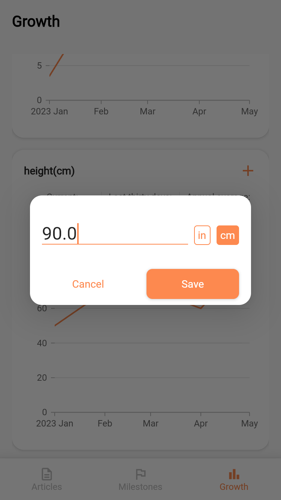

# Care Companion

The mobile application written in Flutter.

## Screenshots

<table>
  <tr>
    <td></td>
    <td></td>
    <td></td>

  </tr>
 <tr>
    <td></td>
    <td></td>
    <td></td>
  </tr>
  <tr>
      <td></td>
    <td></td>
    <td></td>
  </tr>

</table>
